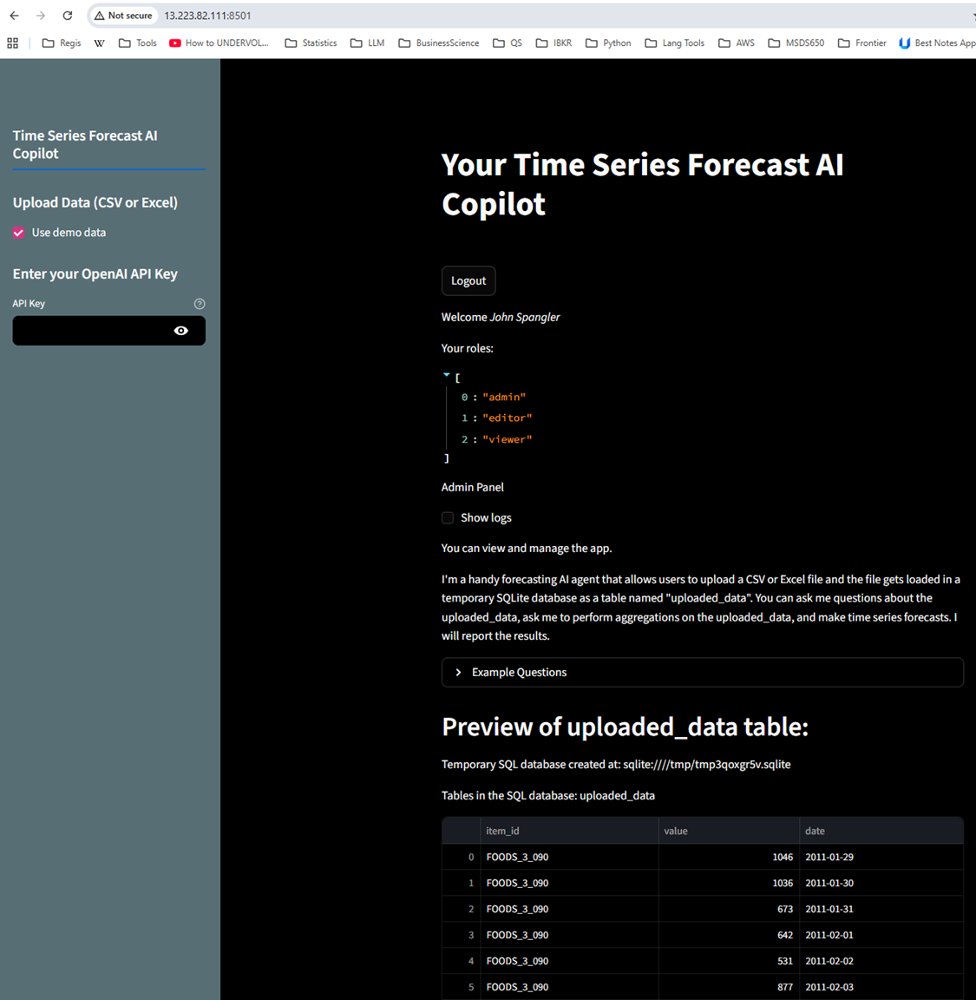
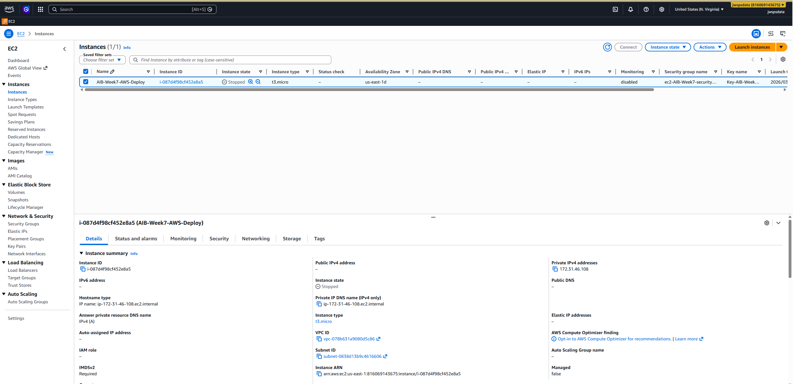

# AWS EC2 + Docker Deployment — Time Series Forecast AI Copilot

## Live Deployment Evidence

### App Running on AWS EC2

The app was successfully deployed and accessed at `http://13.223.82.111:8501`, running inside a Docker container on an AWS EC2 t3.micro instance (us-east-1).



> *Your Time Series Forecast AI Copilot running live on AWS EC2, authenticated as admin user John Spangler.*

### AWS EC2 Console — Stopped Instance

The instance `AIB-Week7-AWS-Deploy` (i-087d4f98cf452e8a5) is stopped after deployment to avoid ongoing compute charges. The EBS volume and configuration are preserved and can be restarted at any time.



> *EC2 instance `AIB-Week7-AWS-Deploy` — t3.micro, us-east-1d (N. Virginia). Stopped to eliminate compute charges while preserving deployment evidence.*

---

## Architecture

```text
Internet
   │
   ▼
AWS EC2 t3.micro (us-east-1)
   │
   ├── nginx-proxy (port 80/443)
   │      │  SSL termination via Let's Encrypt
   │      │  Reverse proxy → streamlit-app:8501
   │      │  Domain: ai.business-science.io/time-series-app/
   │
   ├── streamlit-app (port 8501, internal only)
   │      │  Python 3.11-slim Docker image
   │      │  Streamlit + LangGraph async forecast team
   │
   └── certbot
          │  Let's Encrypt SSL certificate renewal
```

---

## Tech Stack

| Layer | Technology |
| --- | --- |
| Cloud | AWS EC2 t3.micro (us-east-1d) |
| Containerization | Docker + Docker Compose |
| Reverse Proxy | Nginx with SSL termination |
| SSL | Let's Encrypt (Certbot) |
| App Framework | Streamlit |
| AI / Agents | LangGraph (async), LangChain, OpenAI |
| Forecasting Model | XGBoost (`XGBRegressor`) — fits on engineered time-series features, generates predictions with 95% conformal confidence intervals |
| Authentication | streamlit-authenticator (username/password, Google OAuth, Microsoft OAuth) |
| Data | CSV/Excel upload → temporary SQLite database |

---

## Docker Image

The app is containerized and published to Docker Hub as a private image.

**Build commands (linux/amd64 for EC2 compatibility):**

```bash
docker build --platform linux/amd64 -t streamlit-app-time-series-forecast .
docker tag streamlit-app-time-series-forecast:latest jwspsdata/streamlit-app-time-series-forecast:latest
docker push jwspsdata/streamlit-app-time-series-forecast:latest
```

**Dockerfile highlights:**

- Base image: `python:3.11-slim`
- `PIP_DEFAULT_TIMEOUT=600` and `PIP_RETRIES=10` to handle heavy ML dependencies during build
- `xgboost==2.0.3` pinned to eliminate unneeded GPU functionality (reduced image build time to ~20 min)
- Streamlit launched with `--server.address=0.0.0.0` so nginx can reach it inside the Docker network

---

## Docker Compose Stack

Three containers managed together via `docker-compose.yml`:

```yaml
services:
  app:        # Streamlit app on port 8501 (internal only)
  nginx:      # Reverse proxy on ports 80/443 with SSL
  certbot:    # Let's Encrypt certificate renewal
```

The Streamlit container is never exposed directly to the internet — all traffic flows through nginx, which handles HTTPS termination and proxies WebSocket connections (required for Streamlit's live updates).

---

## Nginx Configuration Highlights

- HTTP (port 80) → permanent redirect to HTTPS
- HTTPS (port 443) with Let's Encrypt SSL cert at `ai.business-science.io`
- Proxies `/time-series-app/` → `streamlit-app:8501`
- `proxy_read_timeout 86400` — supports long-running forecast operations without timing out
- `Upgrade / Connection "upgrade"` headers — required for Streamlit WebSocket

---

## App Features Deployed

- **Authentication** — username/password login with hashed passwords; Google and Microsoft OAuth via `streamlit-authenticator`; role-based access (admin / editor / viewer)
- **File upload** — CSV or Excel files converted to a temporary SQLite database on upload
- **Demo data** — Walmart sales dataset pre-loaded for quick demonstrations
- **AI Forecast Agent** — async LangGraph team answering natural-language questions, generating SQL aggregations, and producing time series forecasts; the forecasting engine uses **XGBoost** (`XGBRegressor`) with engineered date features (year, month, day, weekday, numeric index), conformal prediction for 95% confidence intervals, and `pytimetk` for future frame generation
- **OpenAI API key** — loaded from Streamlit secrets vault or entered manually in the sidebar

---

## Cost Management

The EC2 instance is **stopped** (not terminated) after use:

- **No compute charges** when stopped
- EBS storage (~$0.08/GB/month) is the only ongoing cost
- Instance configuration, security groups, and key pair are preserved
- Can be restarted in ~60 seconds to demonstrate the live deployment again

To fully eliminate costs: terminate the instance and release any associated Elastic IP.
