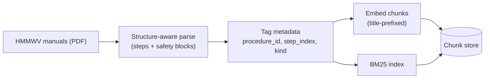
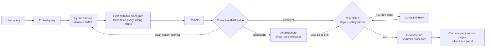

# RAG Architecture: Retrieval-Augmented Procedure Retrieval for Technical Manuals

*The live proof of concept described here is running at [jws-ai-portfolio.streamlit.app](https://jws-ai-portfolio.streamlit.app/), under "TechGuides."*

## The Problem

A technician asks a question about a specific maintenance step on a military ground vehicle — a HMMWV, in this case — over a corpus of dense technical manuals (the Operator's Manual plus all three volumes of the Unit Maintenance Manual: ~1,240 procedures, ~11,500 indexed chunks). A standard RAG pipeline — chunk on token count, embed, retrieve top-k by similarity — breaks the one requirement that actually matters here: **if a query touches any part of a numbered procedure, the system must return every step of that procedure, in order, plus every WARNING/CAUTION/NOTE block bound to it — never left to retrieval-similarity chance.** Similarity scoring has no concept of "this step belongs to that procedure, and procedures are atomic." A query about "step 3" that gets steps 1, 3, and 4 back — silently dropping the safety warning bound to step 2 — is not a near-miss. It's the one failure mode this whole system exists to prevent.

That constraint shaped every layer below. The build followed a staged strategy brief's own tiered structure; what follows is what actually shipped at each tier, not the plan.

## Foundation — Ingestion

Parsing that understands procedure structure, not token windows. The ingestion parser reads the manuals' own convention (numbered/lettered steps, bound safety blocks) instead of chunking on a fixed size, and tags every chunk with the procedure it belongs to. This is what makes the completeness guarantee possible at all — it can't be enforced against content that was never structurally identified in the first place. Each chunk's searchable text is also prefixed with its procedure's own title (a lightweight form of contextual retrieval), so a title-phrased query can find it even when the chunk's own body text never repeats the title.

## Retrieval & Verification — Per Query

Four mechanisms work together here, each catching a different way the completeness guarantee could fail silently:

- **Procedure expansion** — the moment any chunk from a procedure is retrieved, every sibling chunk is force-fetched by ID. This is deterministic, not similarity-based — a procedure's safety warning is included because it's *part of the same procedure_id*, never because it happened to score well.
- **Hybrid search** — dense embeddings alone miss exact-match queries (part numbers, nomenclature); BM25 lexical scoring is fused in alongside it.
- **A Corrective RAG judge** — a lightweight model scores whether the retrieved candidates are actually relevant, and separately flags genuine ambiguity (two real, different procedures a query could plausibly mean). A harness-enforced cap bounds retries to exactly one — the judge can recommend trying again, but only the code decides when to stop, so a misbehaving judge can never cause an infinite loop. When ambiguity is flagged, generation is skipped entirely — the system shows the real candidates and lets the user choose, rather than generating a full answer for a guess.
- **A deterministic, code-level completeness check on the generated response itself** — every step and every bound block is checked for verbatim presence before the response is accepted. One corrective retry is allowed; if it still doesn't check out, the system says so honestly rather than presenting a possibly-incomplete answer as certain.

The chat UI, rendered source-page images, and a live trace panel sit downstream of this pipeline (the "tie-in" box above) — worth noting, but a separate concern from the RAG mechanics themselves.

## Deliberately Not Built

An agentic retrieval loop or query-decomposition step — this is a two-hop problem (retrieve, then possibly re-retrieve once), not a multi-hop reasoning one. And GraphRAG — no entity-relationship reasoning need exists here. Both were assessed and correctly set aside rather than defaulted into.

## Built to Run Disconnected

Technical manuals for field-deployed equipment often need to be usable somewhere without reliable network access — a maintenance bay with spotty connectivity, or fully air-gapped. Every model role in this pipeline (embedding, reranking, judging, generation) is config-selected rather than hardcoded, specifically so the whole system can run on small, locally-hosted, open-weights models instead of hosted APIs — a configuration change, not an architecture change. The one hard constraint is the embedding model: whatever embedded the corpus at index time must be the exact same model embedding queries at runtime, since different embedding models produce vector spaces that aren't comparable. Everything else — reranking, judging, generation — is freely swappable. This proof of concept runs on hosted APIs for convenience, but nothing about the pipeline above assumes a network connection is available.

## What's Distinctive About This

Most RAG write-ups treat retrieval quality as a ranking problem — get the right chunks near the top. This one treats correctness as a **provable, code-verified property**, with the model doing only the parts that genuinely need judgment: scoring relevance, recognizing ambiguity, and writing the one answer the system commits to. The procedure-expansion safety net and the completeness check are the real engineering core here — neither is a common off-the-shelf RAG pattern, and both exist because a "usually right" retrieval pipeline isn't an acceptable answer when the content is a safety-critical maintenance procedure. That's also the throughline back to the business problem this was built to demonstrate: a retrieval system that can state, and mean, "this is complete" — not just "this is probably relevant."
